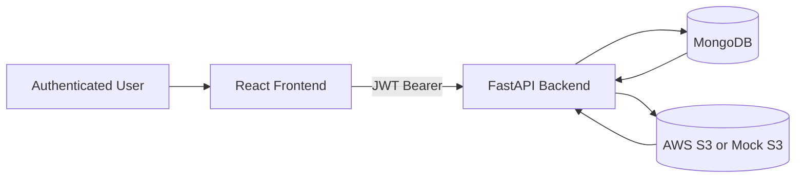

# MediVault

MediVault is a secure, resumable medical file upload platform with per-user bucket management, multipart upload recovery, and operational dashboards.

## What It Solves

MediVault helps teams upload large medical assets (DICOM, image sets, PDFs, ZIP packages) reliably to S3-compatible storage, even on unstable networks.

## System At A Glance



## Core Capabilities

- JWT authentication with session-scoped browser login state.
- Chunked multipart upload with pause, resume, retry, and abort.
- Strict bucket-session matching to avoid cross-bucket upload mistakes.
- Per-user bucket credential vault with encrypted secret storage.
- Bucket metadata management (display name, region, size limit, KMS, notes).
- Upload history and bucket usage analytics.
- Background cleanup for expired in-progress multipart sessions.

## Repository Layout

```text
medivault/
├── README.md
├── CONTRIBUTING.md
├── CHANGELOG.md
├── LICENSE
├── .env.example
├── docker-compose.yml
├── docs/
│   ├── ARCHITECTURE.md
│   ├── API.md
│   ├── SECURITY.md
│   ├── DEPLOYMENT.md
│   ├── DATA_MODEL.md
│   ├── TESTING.md
│   ├── TROUBLESHOOTING.md
│   └── GLOSSARY.md
├── frontend/
└── backend/
```

## Quick Start

### 1. Prerequisites

- Python 3.11+
- Node.js 20+
- Docker Desktop (for MongoDB via Compose)

### 2. Configure Environment

1. Copy `.env.example` values into `backend/.env`.
2. Set a strong `JWT_SECRET_KEY`.
3. Set a valid `ENCRYPTION_KEY` (Fernet key).
4. Add Mongo and AWS settings.

### 3. Start MongoDB

```powershell
docker compose up -d mongo
```

### 4. Start Backend

```powershell
cd backend
pip install -r requirements.txt
uvicorn app.main:app --reload
```

### 5. Start Frontend

```powershell
cd frontend
npm install
npm run dev
```

### 6. Access App

- Frontend: http://localhost:5173
- Backend health: http://127.0.0.1:8000/health

## Docs Index

- Architecture: docs/ARCHITECTURE.md
- API: docs/API.md
- Security: docs/SECURITY.md
- Deployment: docs/DEPLOYMENT.md
- Data model: docs/DATA_MODEL.md
- Testing: docs/TESTING.md
- Troubleshooting: docs/TROUBLESHOOTING.md
- Glossary: docs/GLOSSARY.md

## Current Notes

- Upload target bucket selection is mandatory before upload actions.
- Auth token is stored in session storage (tab/window close logs out).
- `docker-compose.yml` currently provisions MongoDB service only.

## devs
- Marudhu B
- Anuraag Rai S
- Chandru P
- Muthuvel Mukesh 
