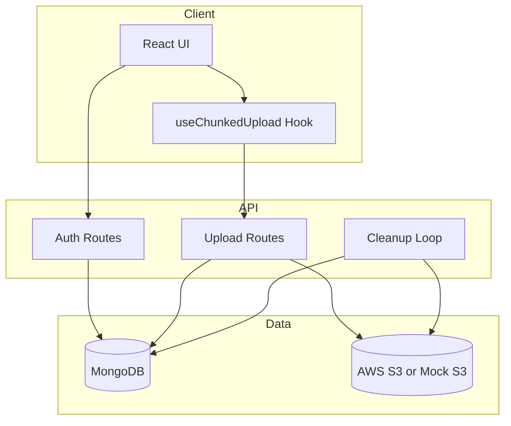
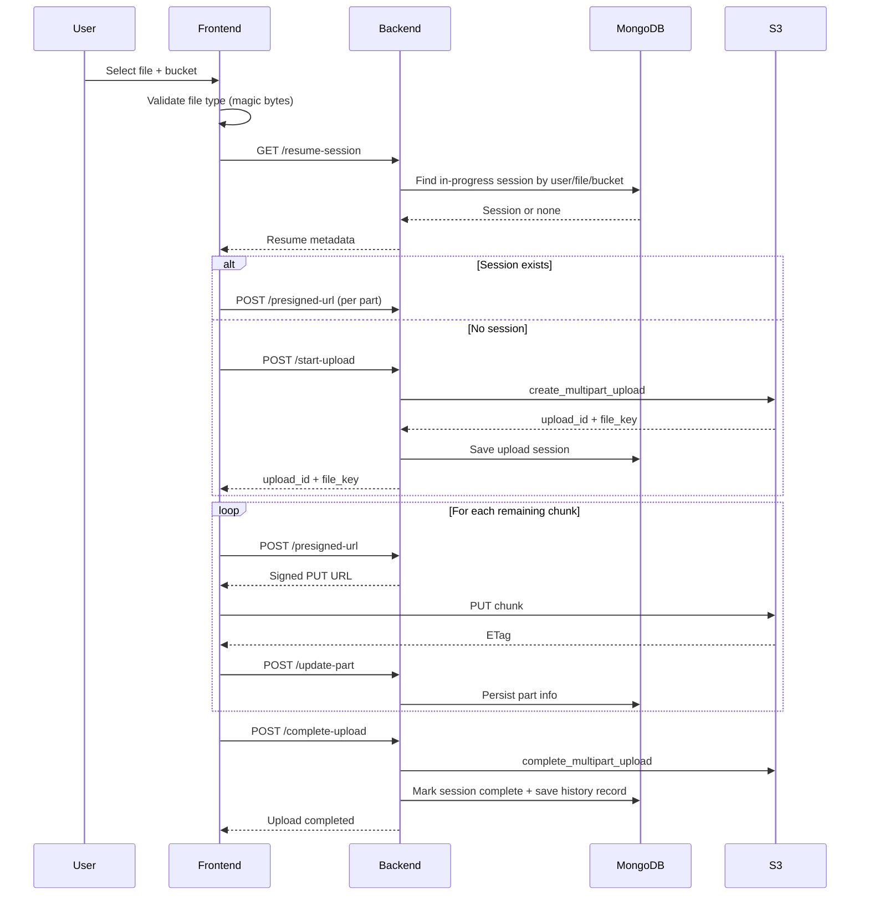
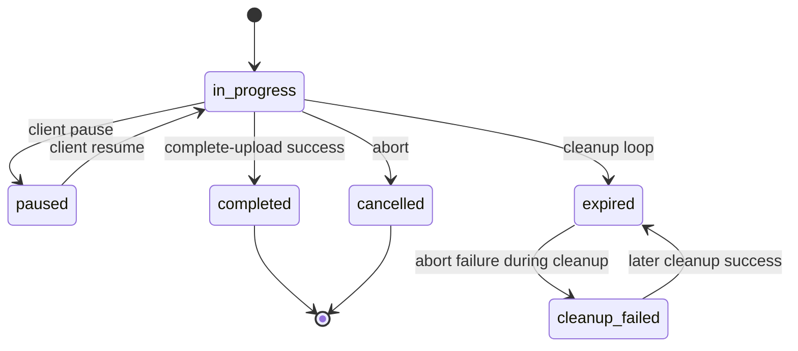

# Architecture

## 1. Overview

MediVault is a two-tier application:

- Frontend: React + Vite client for authentication, bucket management, upload control, and analytics.
- Backend: FastAPI service handling auth, multipart upload orchestration, bucket credential vault, and history APIs.

Persistent state is stored in MongoDB, while binary payload data is stored in S3-compatible object storage.

## 2. Component Map

## 3. Runtime Responsibilities

### Frontend

- Validates file type by magic bytes before upload.
- Splits files into multipart chunks.
- Requests pre-signed URLs per part.
- Uploads parts in parallel with retry/backoff.
- Tracks progress, status, ETA, and adaptive telemetry.
- Stores auth token in session storage.

### Backend

- Issues and validates JWT access tokens.
- Stores encrypted bucket credentials by user.
- Starts/resumes/completes/aborts multipart uploads.
- Enforces bucket-session consistency across upload operations.
- Records upload history and bucket usage metrics.
- Cleans up expired unfinished upload sessions.

## 4. Upload Lifecycle

## 5. Upload Session State Model

## 6. Bucket Context Strategy

- Bucket is selected by user in UI before upload actions.
- Backend resolves bucket credentials from MongoDB per user.
- Session binds bucket_id and bucket_name at start.
- Later presign, complete, and abort requests validate bucket match.

## 7. Security-Critical Boundaries

- Credentials are encrypted before persistence.
- JWT protects all non-auth upload and bucket routes.
- Rate limiting is applied to auth and upload APIs.
- Secrets are not returned to frontend.

## 8. Operational Services

- Startup checks MongoDB connectivity and required indexes.
- Periodic cleanup task scans expired in-progress sessions.
- Health endpoint exposes backend liveness.
