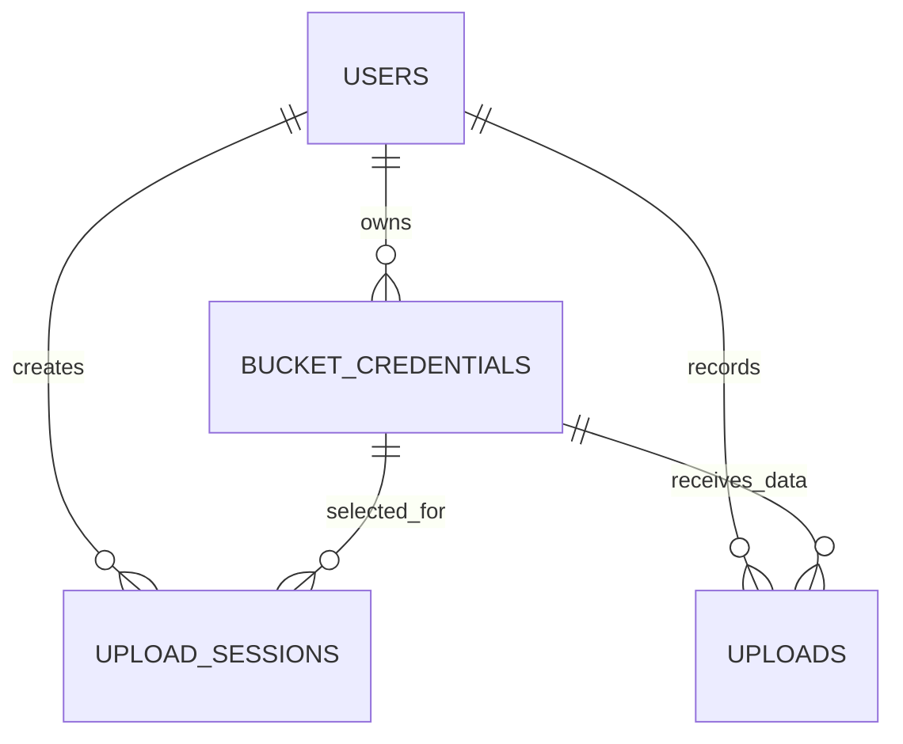
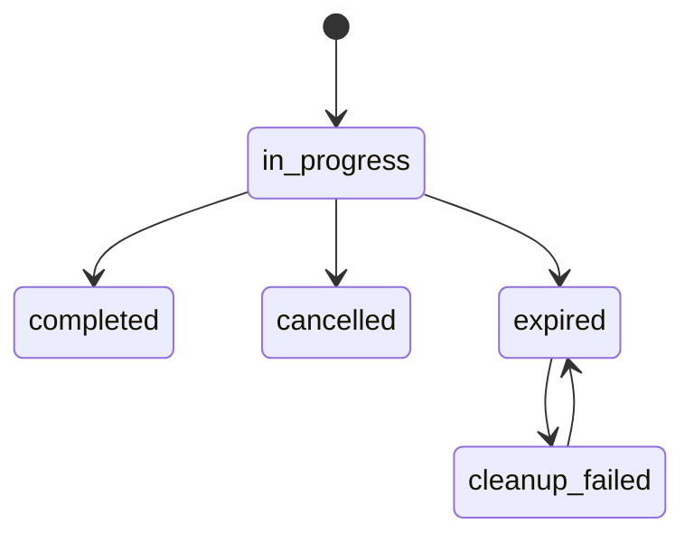

# Data Model

## 1. Storage Overview

MediVault uses MongoDB for application metadata and S3 for binary object content.

- MongoDB: users, bucket configs, upload sessions, upload history.
- S3: multipart objects and completed object payloads.

## 2. Entity Relationship View

## 3. MongoDB Collections

### users

Purpose:

- Stores authentication identities.

Core fields:

- username: string (unique expected)
- password: string (bcrypt hash)

### bucket_credentials

Purpose:

- Stores per-user bucket access context and metadata.

Core fields:

- _id: ObjectId
- user_id: string
- bucket_name: string
- display_name: string
- region: string
- size_limit: number (bytes)
- access_key_encrypted: string
- secret_key_encrypted: string
- validation_status: string
- use_kms: bool
- kms_key_id: string or null
- notes: string
- created_at: ISO timestamp
- updated_at: ISO timestamp

### upload_sessions

Purpose:

- Tracks in-progress or terminal multipart session metadata.

Core fields:

- _id: ObjectId
- user_id: string
- file_id: string
- filename: string
- upload_id: string
- file_key: string
- bucket_id: string
- bucket_name: string
- size: number
- checksum: string
- total_parts: number
- uploaded_part_numbers: number[]
- parts_uploaded: [{ PartNumber, ETag }]
- status: in_progress | completed | cancelled | expired | cleanup_failed
- expires_at: datetime (TTL target)
- created_at: ISO timestamp
- completed_at, cancelled_at, expired_at, cleanup_last_run_at: optional ISO timestamps

### uploads

Purpose:

- Immutable history of completed uploads.

Core fields:

- _id: ObjectId
- user_id: string
- filename: string
- size: number
- checksum: string
- expected_size: number
- actual_size: number
- size_mismatch: bool
- bucket: string
- created_at: ISO timestamp

## 4. Session Status Transitions

## 5. Indexing Strategy

Configured in backend startup:

- upload_sessions.expires_at TTL index with expireAfterSeconds=0
- upload_sessions compound index on status + expires_at

Recommended additional indexes:

- users.username unique index
- bucket_credentials compound index on user_id + bucket_name
- uploads index on user_id + created_at

## 6. Data Retention Notes

- upload_sessions are short-lived operational records.
- uploads act as activity history records.
- bucket credentials remain until deleted by user.
- binary objects in S3 are not deleted when bucket config is removed.
