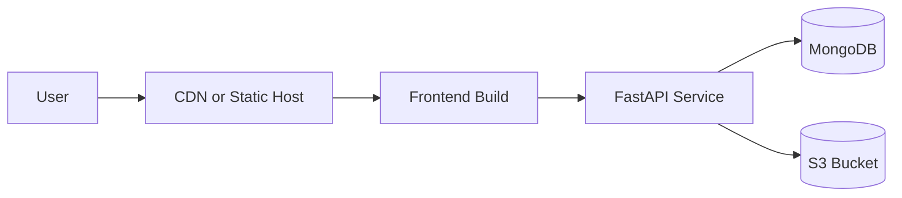

# Deployment

## 1. Deployment Targets

MediVault can run in:

- Local development
- Single-node VM deployment
- Containerized multi-service environments

Current repository includes Docker Compose for MongoDB only.

## 2. Local Development Deployment

### Step 1: Start MongoDB

```powershell
docker compose up -d mongo
```

### Step 2: Configure Backend

- Create backend/.env using values from .env.example.
- Set secure values for JWT_SECRET_KEY and ENCRYPTION_KEY.

### Step 3: Run Backend

```powershell
cd backend
pip install -r requirements.txt
uvicorn app.main:app --host 0.0.0.0 --port 8000 --reload
```

### Step 4: Run Frontend

```powershell
cd frontend
npm install
npm run dev
```

## 3. Production Topology (Recommended)



## 4. Environment Configuration

Required backend variables include:

- MONGO_URI
- MONGO_DB_NAME
- JWT_SECRET_KEY
- ENCRYPTION_KEY
- CORS_ALLOW_ORIGINS
- PRESIGNED_URL_EXPIRY
- UPLOAD_CLEANUP_INTERVAL_SECONDS

Optional for compatibility or test modes:

- USE_MOCK_S3
- MOCK_S3_STATE_FILE
- MOCK_S3_PART_FAILURE_RATE
- AWS_ACCESS_KEY_ID / AWS_SECRET_ACCESS_KEY / AWS_REGION / S3_BUCKET_NAME

## 5. Production Hardening Checklist

- Use HTTPS with HSTS at edge or reverse proxy.
- Restrict CORS_ALLOW_ORIGINS to trusted domain list.
- Keep MongoDB non-public and authenticated.
- Enable monitoring for 4xx and 5xx spikes.
- Set secure backup and retention policy for MongoDB.
- Use environment secret manager, not plaintext files.

## 6. Health And Verification

### Health endpoint

- GET /health

Expected response:

```json
{
  "status": "healthy",
  "service": "medical-upload-api"
}
```

### Post-deploy smoke tests

1. Register/login and verify /auth/me.
2. Add bucket and verify list endpoint.
3. Start upload, pause, resume, complete.
4. Verify upload history entry and bucket usage update.

## 7. Data Backup Guidance

For MongoDB backups in operations:

- Schedule regular mongodump snapshots.
- Protect backup storage with encryption and restricted access.
- Test restore process periodically.
