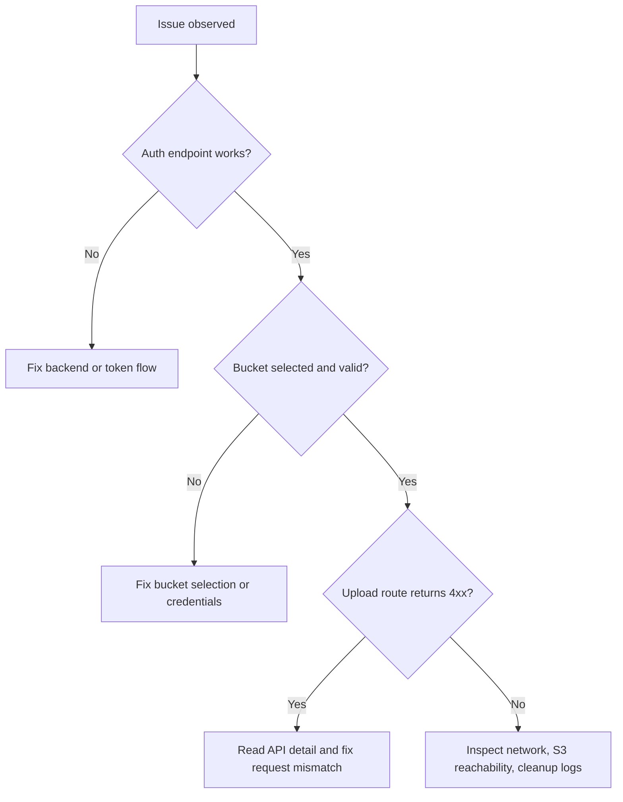

# Troubleshooting

## 1. Frontend Shows Network Error (ERR_CONNECTION_REFUSED)

Symptoms:

- API calls fail immediately from browser.

Checks:

1. Ensure backend is running on 127.0.0.1:8000.
2. Ensure frontend dev server is running.
3. Verify Vite proxy config points /api to backend host.

## 2. Login Works But Actions Return 401

Symptoms:

- Token exists but protected routes fail.

Checks:

1. Token may be expired; log in again.
2. Confirm backend JWT secret matches active environment.
3. Confirm Authorization header is attached by API clients.

## 3. Upload Does Not Start

Symptoms:

- Clicking Start Upload does nothing or warns.

Checks:

1. Select a target bucket first (required).
2. Ensure file type is allowed and passes magic-byte validation.
3. Confirm bucket exists in user bucket list.

## 4. Resume Fails Or Starts New Session

Symptoms:

- Expected resume does not continue existing progress.

Checks:

1. Select the same original bucket used by the upload session.
2. Confirm file identity (name/size) is unchanged.
3. Check backend for 409 bucket mismatch responses.

## 5. Bucket Save Shows Pending Validation

Symptoms:

- Bucket is saved but marked pending.

Meaning:

- Backend stored config but AWS validation failed or network validation could not complete.

Actions:

1. Verify access key/secret key permissions.
2. Verify bucket name and region.
3. Re-save credentials and retest upload.

## 6. Cannot Delete Bucket

Symptoms:

- Delete fails for bucket.

Checks:

1. Type exact phrase Delete Bucket in confirmation modal.
2. Ensure no in-progress uploads are using that bucket.
3. System default bucket entries are locked.

## 7. Upload Stuck In Cleanup States

Symptoms:

- Session remains expired or cleanup_failed.

Checks:

1. Verify cleanup loop is running after backend startup.
2. Inspect bucket credential integrity for affected session.
3. Confirm S3 permissions allow abort multipart operation.

## 8. CORS Problems In Browser

Symptoms:

- Browser blocks API call due to CORS.

Checks:

1. Ensure CORS_ALLOW_ORIGINS includes frontend origin.
2. If using direct S3 upload in any workflow, ensure bucket CORS is configured.
3. Restart backend after env changes.

## 9. Fast Diagnosis Flow

